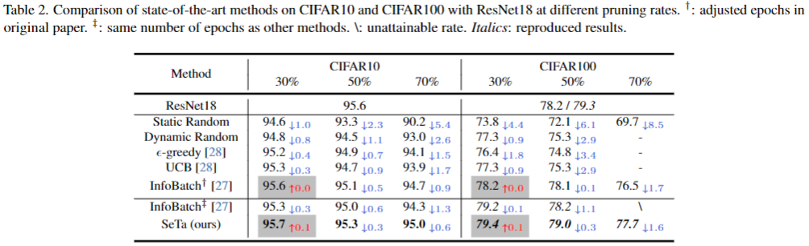

<!-- # Scale Efficient Training for Large Datasets -->
<h2 align="center">Scale Efficient Training for Large Datasets</h2>
<p align="center"><b>CVPR 2025</b> | <a href="https://github.com/mrazhou/SeTa">[Paper]</a> | <a href="https://github.com/mrazhou/SeTa">[Code]</a> </p>

> *Author: Qing Zhou, Junyu Gao, Qi Wang*

> SeTa is a **plug-and-play** efficient training tool for **various and large** datasets with **three-line codes**.

> Support pruning methods: **Random, InfoBatch, and SeTa**.

<p align="center">
  
</p>


### Installation
```bash
pip install git+https://github.com/mrazhou/SeTa
```

Or you can clone this repo and install it locally.

```bash
git clone https://github.com/mrazhou/SeTa
cd SeTa
pip install -e .
```

### Usage
To adapt your code with *SeTa/InfoBatch*, just change the following **three lines**:
```python
from seta import prune

# 1. Wrap dataset
train_data = prune(train_data, args) # args: prune_type, epochs...

# 2. Pass sampler to DataLoader
train_loader = DataLoader(train_data, sampler=train_data.sampler)

for epoch in range(args.epochs):
    for batch in train_loader:
        # 3. Update loss
        loss = train_data.update(loss)
```

### Experiment
In this repository, we provide two examples to demonstrate the usage of SeTa. 
**CIFAR10/CIFAR100 (support resnet18/50/101) and ImageNet (support various CNNs/Transformers/Mamba)** are used as the datasets.

- CIFAR10/CIFAR100 (*for exploratory research.*)
```bash
# For lossless pruning with SeTa
bash scripts/cifar.sh SeTa 0.1 5 0.9

# For InfoBatch
bash scripts/cifar.sh InfoBatch 0.5

# For Static Random
bash scripts/cifar.sh Static

# For Dynamic Random
bash scripts/cifar.sh SeTa 0 1 1
```


- ImageNet (*for large-scale and cross-architecture comprehensive validation..*)
```bash
# For lossless pruning
bash scripts/imagenet.sh

# For CNNs
bash scripts/imagenet.sh SeTa mobilenetv3_small_050

# For Transformers
bash scripts/imagenet.sh SeTa vit_tiny_path16_224

# For Vim
# refer to https://github.com/hustvl/Vim for more details
```

### Results
<div style="text-align: center;">
    
</div>

<div style="text-align: center;">
    
</div>


### Citation
If you find this repository helpful, please consider citing our paper:
```bibtex
@inproceedings{zhou2025scale,
  title={Scale Efficient Training for Large Datasets},
  author={Zhou, Qing and Gao, Junyu and Wang, Qi},
  booktitle={CVPR},
  year={2025}
}
```
and the original InfoBatch paper:
```bibtex
@inproceedings{qin2024infobatch,
  title={InfoBatch: Lossless Training Speed Up by Unbiased Dynamic Data Pruning},
  author={Qin, Ziheng and Wang, Kai and Zheng, Zangwei and Gu, Jianyang and Peng, Xiangyu and Zhaopan Xu and Zhou, Daquan and Lei Shang and Baigui Sun and Xuansong Xie and You, Yang},
  booktitle={The Twelfth International Conference on Learning Representations},
  year={2024}
}
```

### Acknowledgments
Thanks very much to [InfoBatch](https://github.com/NUS-HPC-AI-Lab/InfoBatch) for implementing the basic framework for dynamic pruning by three lines of code.
